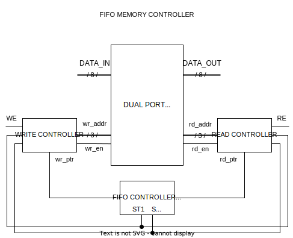

# FIFO Memory Controller
An asynchronous active low reset FIFO memory controller for a data processing system. The FIFO memory is used to store and retrieve data in a first-in-first-out manner. The controller mana the read and write operations, handle data overflow and underflow conditions, and ensure proper data integrity.

- The FIFO memory has a depth of 8 memory locations, each capable of storing 8-bit data.
- The FIFO memory controller has separate read and write ports.
- The controller supports simultaneous read and write operations.
- When reading from the FIFO, data is read in the order it was written.
- If the FIFO is empty, the reading should be blocked until data is available.
- If the FIFO is full, writing should be blocked until space becomes available.
- A status signal is implemented that indicates when the FIFO is empty and when it is full.
- Code is fully parameterized with the parameters of address size and data size.

# Entity: fifo_memory 
- **File**: fifo_memory.v

## Diagram

## Parameters
| Parameter name | Value |
| -------------- | ----- | 
| ADDR_SIZE      |   3   | 
| DEPTH          |   8   | 
| DATA_SIZE      |   8   | 

## Ports

| Port name | Direction | Type        | Description |
| --------- | --------- | ----------- | ----------- |
| clk       | input     | wire        |             |
| rst       | input     | wire        |             |
| RD        | input     | wire        |             |
| WE        | input     | wire        |             |
| data_in   | input     | [DEPTH-1:0] |             |
| data_out  | output    | [DEPTH-1:0] |             |

## Signals

| Name               | Type      | Description |
| ------------------ | --------- | ----------- |
| i                  | integer   |             |
| N                  | integer   |             |
| mem [DEPTH-1:0]    | reg [7:0] |             |
| rd_ptr [DEPTH-1:0] | reg       |             |
| wr_ptr [DEPTH-1:0] | reg       |             |
| rd_addr [DEPTH-1:0]| reg       |             |
| wr_addr [DEPTH-1:0]| reg       |             |

## Processes
- FIFO_MEMORY: ( @(posedge clk or negedge rst) )
  - **Type:** always

## Circuit Diagram

